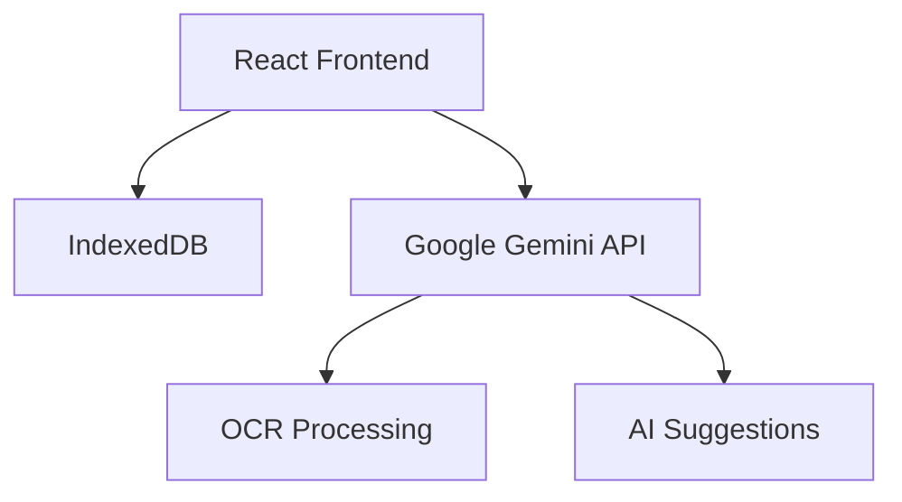

# RecipeSnap 🍳

**AI-Powered Recipe Management System**  
*Scan, organize, and enhance your recipes with intelligent assistance*

🌐 [Live Preview](https://9000-idx-studio-1745386299456.cluster-ikxjzjhlifcwuroomfkjrx437g.cloudworkstations.dev/?monospaceUid=229239)  
🛠️ Built with: React, IndexedDB, Google Gemini 1.5 Pro API  
🔍 *Currently seeking frontend/full-stack opportunities*

 *Replace with actual screenshot*

## Key Features

### 🗄️ Core Recipe Management
- **Local Storage**: Persist recipes in browser via IndexedDB
- **Intuitive CRUD**:
  - Add recipes via form (title, tags, ingredients, instructions)
  - Edit all fields with unified interface
  - Delete with confirmation
- **Smart Search**: Filter by title or custom tags
- **Responsive UI**: Clean layout with shadcn/ui components

### ✨ AI Enhancements
| Feature | Description |
|---------|-------------|
| **Recipe Scanning** | Extract text from images using Google Gemini OCR |
| **AI-Assist Mode** | Get smart suggestions for tags/ingredients |
| **Form Optimization** | Context-aware field auto-completion |

## Technical Implementation

Key Technologies:

Frontend: React (Vite), shadcn/ui

State Management: React Hooks

AI Integration: Custom API endpoints (/api/ai/ocr, /api/ai/analyze)

Navigation: SPA routing with view persistence

roject Roadmap
✅ Implemented
Local recipe storage

Basic AI integration

Core CRUD operations

🚧 Planned Features
Google Drive sync

Offline capability

Multi-page OCR

Advanced AI suggestions

Known Limitations
⚠ Online Requirement: AI features require internet
⚠ Browser-Specific Storage: No cross-device sync
⚠ Preview Environment: Best experienced in local deployment

About the Developer
👋 Hi! I'm Alejandro Juanin Ferrazzini, a Vibe coder developer passionate about:

AI/ML integration

Clean UI/UX

Performance optimization

📫 Let's connect: ajferrazzini@gmail.com | LinkedIn | Portfolio

"Good food should be easy to organize" - This project was built to solve my own recipe management challenges.

